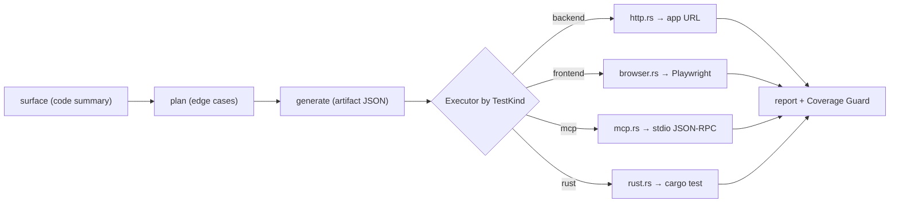
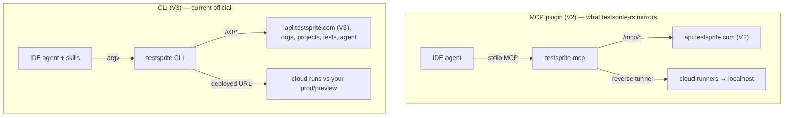
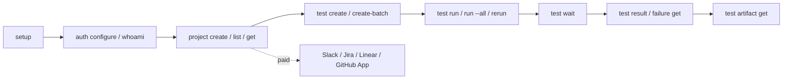
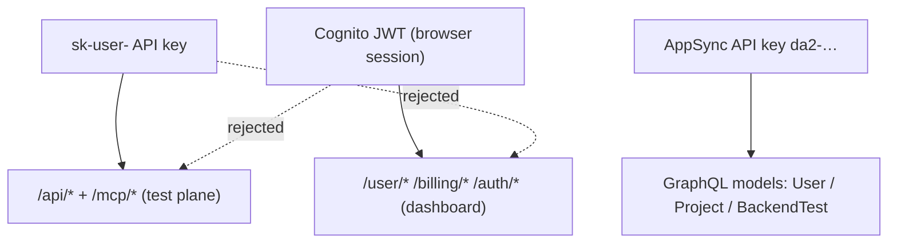

# AGENTS.md

Guidance for AI agents (and humans) working in **testsprite-rs**.

## What this is

A from-scratch **Rust** reimplementation of the TestSprite MCP client
(`@testsprite/testsprite-mcp`). It has two halves that share the same types:

1. **Client** — speaks the real cloud protocol (`api.testsprite.com`), opens the
   reverse tunnel (`*.tun.testsprite.com`, yamux v2), and exposes 7 MCP tools
   over stdio (`mcp.rs::tool_list`; the README says "8", counting an
   original-plugin tool this port folds in).
2. **Local server** (`testsprite-rs backend`) — a drop-in local stand-in for the
   cloud, so the whole flow runs with no account and no network beyond the app
   under test. One pipeline (`surface → plan → generate → execute → report`)
   where only the *executor* varies by modality.

It is a research reimplementation, not affiliated with TestSprite. See
`README.md` for protocol details and the full flow.

## Build / test / lint

```bash
cargo build            # edition 2024
cargo test             # 10 unit tests (server/coverage.rs + src/local/) — must stay green
cargo clippy --all-targets   # keep at 0 warnings (project standard)
```

Run modes:

```bash
testsprite-rs serve                    # stdio MCP server (default subcommand)
testsprite-rs account | check          # verify API key / show account
testsprite-rs generate-code-and-execute# console: tunnel → dispatch → poll → report
testsprite-rs backend --port 8787 --model gpt-4o-mini --kind backend
#   --kind ∈ { backend | frontend | mcp | rust }
```

## Local test flow — no cloud, no key (`project` / `test`)

The simplest way to use this tool: a local, JSON-driven `setup → add → run`
lifecycle that reuses the `Executor` seam directly (no server, no tunnel). Full
diagram + data model in [`docs/FLOW.md`](docs/FLOW.md).

```bash
testsprite-rs project init --type backend --name myapp --url http://127.0.0.1:8080
testsprite-rs test add --file plan.json      # → SQLite (testsprite_tests/testsprite.db)
testsprite-rs test list
testsprite-rs test run                        # all tests; --id <id> for a subset
#   exit 0 if every test passed else 1; appends a row to the runs table (append-only history)
testsprite-rs test generate --instruction "…" --type backend  # LLM plans cases (needs OPENAI_API_KEY)
testsprite-rs test run --json --fix                            # LLM code-gen + failure analysis + fix patch
#   with a key: spec-less {title,description} cases get LLM-generated code; failures
#   get a bug/fragility verdict, and --fix writes a repair diff to fixes/<id>.md for your agent
```

A test case is just JSON; the backend deterministic path needs no LLM:

```json
{ "title": "health 200", "kind": "backend",
  "spec": { "method": "GET", "path": "/health", "expect_status": 200 } }
```

`test run` loads the project + each test and calls
`executors::for_kind(kind).run(case, &ExecCtx{ target, llm, prd })` — the same
seam the cloud path uses; `llm` is `LlmClient::from_env(model)` (`None` =
deterministic). Code: `src/local/{project,store,run,generate}.rs`.

## Environment

| Var | Purpose | Default |
|---|---|---|
| `API_KEY` | `sk-user-…` bearer key (client → cloud) | required for cloud calls |
| `API_URL` | REST base | `https://api.testsprite.com` |
| `TESTSPRITE_URL` | dashboard base (for result URLs) | `https://www.testsprite.com` |
| `TSEMCP_TUNNEL_CONTROL_URL` | control-plane WS | `wss://control.tun.testsprite.com/ws` |
| `TSEMCP_TUNNEL_DATA_ADDRESS` / `_DATA_HOST` / `_DATA_PORT` | yamux data plane | `data.tun.testsprite.com:7400` |
| `TSEMCP_TUNNEL_PROXY_URL` | proxy handed to the cloud runner | `http://proxy.tun.testsprite.com:9090` |
| `TSEMCP_TUNNEL_VERSION` | force tunnel version (0=ask, 1, 2) | `0` |
| `OPENAI_API_KEY` | enables LLM mode in `backend` | falls back to deterministic engine |

LLM mode also reads `~/.config/jfc/credentials.toml` → `[openai].api_key`.
Every endpoint/value is env-overridable; defaults point at production.

## Architecture

Two halves, one shared type layer (`types.rs`, `envs.rs`, `paths.rs`).

### Client (talks to the real cloud)

| Module | Role |
|---|---|
| `main.rs` | clap CLI + subcommand dispatch |
| `mcp.rs` | stdio JSON-RPC MCP server: `initialize` / `tools/list` / `tools/call` |
| `tools/*` | the 7 MCP tool handlers, incl. the `generate_code_and_execute` orchestrator (`execute.rs`) |
| `tunnel/{protocol,client,mod}.rs` | yamux-v2 reverse tunnel: frame codec, control WS, data plane |
| `backend.rs` | REST client for `api.testsprite.com` (bearer auth + multipart + poll) |
| `config.rs` / `paths.rs` | `testsprite_tests/tmp/config.json` + on-disk layout |
| `net.rs` / `report.rs` | port/tunnel probes; markdown report builder |

### Local server (`server/`, stand-in for the cloud)

| Module | Role |
|---|---|
| `server/mod.rs` | axum HTTP + accept-only control WebSocket |
| `server/api.rs` | the REST contract the client calls (router + handlers) |
| `server/llm.rs` | OpenAI PRD / plan / test-code generation |
| `server/engine.rs` | deterministic generator (no-LLM fallback) from `api_endpoints` |
| `server/store.rs` | test store + the single execution path |
| `server/coverage.rs` | Coverage Guard: declared vs. exercised surface (+ Mermaid) |
| `server/executors/` | the `Executor` seam |

### The Executor seam (the load-bearing abstraction)

`server/executors/mod.rs` defines `trait Executor` and `enum TestKind`. The
store, API, planner, and Coverage Guard are all modality-agnostic; only the
executor changes. A test case is just JSON (`{id,title,description,spec?}`), and
the `LlmClient` is injected once (single owner) into `ExecCtx` — executors never
construct their own. When adding a modality:

- Add a `TestKind` variant + `parse` mapping,
- Implement `Executor` (`label`, `run`) in a new `executors/<kind>.rs`,
- Wire it in `for_kind`.

Do **not** add a parallel code path or thread modality logic through the store /
API / planner — that defeats the seam.

## Conventions

- **Mirror the original plugin** module-for-module (see the Module map in
  `README.md`); keep that correspondence when adding features.
- **Everything env-overridable** with a production default (`envs.rs` pattern).
- **A case is JSON.** Don't add modality-specific structs to the planner/store.
- **Errors:** `anyhow::Result` at boundaries; non-2xx maps to hard-stop
  semantics matching the plugin (`backend.rs::check`).
- **Zero clippy warnings** is the bar; fix at the source, don't `#[allow]` around it.
- Unit tests live in-module under `#[cfg(test)]` (see `coverage.rs`).

## Cleanup & modularization findings

Grounded assessment (codegraph + `cargo build/test/clippy`, 2026-07):
the codebase is **genuinely well-factored** — do not invent a large refactor.

- **No monoliths.** Largest source files: `api.rs` 346, `backend.rs` 296,
  `execute.rs` 293, `tunnel/client.rs` 277, `llm.rs` 220 lines. All are single-
  responsibility and cohesive.
- **Clean signals.** `cargo build` + `cargo clippy` at 0 warnings; `cargo test`
  4/4; codegraph vuln scan 0 findings across 592 functions.

Minor, optional items (in priority order):

1. **Thin test coverage is the real gap.** Only `coverage.rs` has unit tests.
   Highest-value work: add pure-function unit tests for `tunnel/protocol.rs`
   (frame encode/decode round-trip), `engine.rs::concrete_path` (`{param}`
   templating), `execute.rs::parse_endpoint` (host/port parsing), and
   `account.rs::mask_api_key` / `execute.rs::redact` (secret masking). These are
   deterministic and currently unverified.
2. **`parse_endpoint` name collision.** Two unrelated functions share the name —
   `tools/execute.rs` (URL → `(host, port)`) and `server/engine.rs`
   (JSON → `EndpointSpec`). Not duplication, but consider renaming to
   `parse_host_port` / `parse_endpoint_spec` for clarity.
3. **`api.rs` split — only if it grows.** At 346 lines it's fine. Handlers are
   already grouped by comment banners (account/tunnel, PRD, plans, run, poll,
   coverage, sinks); a natural split into `api/{plan,run,coverage}.rs` submodules
   is available but not warranted at the current size.
4. **Not slop:** `log_sink` / `test_summary` in `api.rs` are intentional no-op
   acks for endpoints the client calls but a local backend needn't process.
   Leave them.
5. **`frontend` executor — verified e2e via Docker.** The browser executor runs
   chromium/firefox on the host, and **webkit** (which needs system libs the host
   often lacks) inside a small derived Playwright image (`server/executors/
   browser.rs::ensure_playwright_image`, auto-built once from the official base +
   the `playwright` npm package). `test run --browser webkit` auto-routes to
   Docker; `TESTSPRITE_BROWSER_DOCKER=1` forces any browser into the container
   (host-independent rescue). All three verified against a live page (webkit/
   chromium/firefox PASS; dead URL → real Playwright error). The `rust` executor
   still has only the deterministic `cargo build` fallback exercised.

Recently landed (branch `feat/cli-v3-parity`): UTF-8-safe head+tail output
truncation (`clip`); `test history` + MCP `testsprite_run_history`; **webkit via
Docker** (auto for webkit, `TESTSPRITE_BROWSER_DOCKER=1` forces any browser);
dogfood harness (`dogfood/` — testsprite-rs green-gates its own repo via its own
executor); `test rerun --failed`; `doctor --json` (+docker check); **test lists**
(`test list/run --group`); **BE dependency waves** (`produces`/`needs`/
`category:"teardown"` in the test body → `waves::order_by_waves` topo-orders
`run`, teardown last, cycle-safe); local **schedules** (`schedule
add|list|run|crontab` → OS cron). Precedence: `--group` beats `--id`; wave
ordering also reorders explicit `--id` subsets by declared deps (no-op without).

Execution model (`run_collect`): dependency **skips** (a failed/skipped
producer marks downstream `needs` consumers `verdict=blocked` "skipped:
dependency…" instead of running them into confusing failures; cascades
transitively), **opt-in parallelism** (`test run --jobs N` runs independent
same-level tests concurrently; default 1 sequential, since the community
reported parallel-causes-failures), and **graceful teardown** (SIGINT via
synchronous `unix::signal` stops launching new waves but still runs the
teardown phase). Run history is bounded: `write_result` auto-prunes to
`TESTSPRITE_RUN_HISTORY_KEEP` (default 200) per test; `test prune [--keep N]`.
Agent **auto-approve** (`agent message --auto-approve`, MCP `auto_approve`) executes
the proposed action immediately — mirrors TestSprite's `/v3/agent/settings.autoApprove`.

**Code Diff Mode** (`src/local/changed.rs`) — `git diff <ref>` → changed lines
attributed to enclosing functions (via the tree-sitter structural surface,
`--no-ext-diff` so difftastic/delta don't interfere) → intersect with each test's
declared surface (the `mentions` whole-word matcher): `test run --changed
[--since <ref>]` runs ONLY affected tests, `test generate --changed` synthesizes
tests for changed functions no test covers, `test changed` inspects. Also over MCP
(`testsprite_run`/`testsprite_generate` `changed`/`since`). This is TestSprite's "test
what you just changed" pre-merge loop, local. `ci init` writes a `pull_request`
GitHub Actions workflow that runs `gate` (2.1's "PR blocks merge"). `test generate
--doc <file>` distills a normalized PRD from an arbitrary README/notes/Jira/spec.

**Path-param seeding** — `engine::concrete_path(path, vars)` looks up a `{param}`
in a variables map before the `1` probe fallback, so deterministic specs hit real
records (`/users/{id}` -> a real UUID) instead of 404ing. Map lives in
`testsprite_tests/variables.json`, loaded into `ExecCtx.variables`; set via
`project set-var <key> <value>`. **Discord graceful shutdown** — `discord::run`
traps Ctrl+C and calls `shard_manager.shutdown_all()` to close the gateway cleanly.

**PRD persistence** — `test generate` (doc/summary/instruction) used to distill a
PRD → plan → cases in memory and persist ONLY the leaf cases, so the SQLite DB had
no record of *why* the cases exist. Now the PRD + plan are saved to a `prd` table
(`store::{save_prd,list_prds,load_prd,latest_prd_id}`) and mirrored to
`standard_prd.json` / `testsprite_{backend,frontend}_test_plan.json`; each generated
case is stamped with its `prdId`. Inspect via `testsprite-rs prd list` / `prd show
[<id>]`; MCP `testsprite_generate` returns `prdId`. The `doc → PRD → plan → cases`
trail is now fully inspectable, not just the leaves.

**Live-app serve** — backend/`spec` cases hit the project's `target_url`; if
nothing is listening they env-fail (which is why agents used to degrade to `cargo
test` wrappers). `project set-start "<cmd>"` persists a start command
(`Project.start_command`, DB column via idempotent ALTER), and `test run --serve`
(MCP `testsprite_run` `serve:true`) boots the app (`serve::start_and_wait`: skip if
`target_url` already reachable, else `sh -c` + wait on `net::check_port_listening`
up to `TESTSPRITE_SERVE_READY_SECS`=30), runs the cases against the LIVE server, and
tears it down (`kill_on_drop` RAII — no orphan on early return/panic/SIGINT).

**Structured API-doc import** — `test generate --doc <file>` first tries
`apidoc::extract` (`src/local/apidoc.rs`): Postman collections, OpenAPI/Swagger
(JSON **or** YAML), and HAR → deterministic `{method,path,expect_status?}` `spec`
cases + a synthesized PRD, with **no OpenAI key and no per-run codegen** (they run
via `execute_spec`/reqwest against the live target; `{{id}}`/`:id`/`{id}` normalize
to `{id}` for `concrete_path` + `variables.json`). Only unstructured docs fall back
to the LLM. This is what makes generated backend cases actually runnable — pair
with `--serve` to exercise them live. Unreachable failures (connection-refused /
urllib3 "error sending request"/"max retries") now classify as `network`/Blocked
(env, not a bug) with a "run `test run --serve`" hint instead of a raw traceback.

## The official TestSprite today (reverse-engineered, 2026-07)

TestSprite ships in **two client generations**; `testsprite-rs` currently mirrors
the older one.

- **MCP plugin** `@testsprite/testsprite-mcp` — what this repo reimplements. 7
  stdio MCP tools; the agent writes `code_summary.yaml`, the cloud generates
  PRD → plan, a reverse tunnel exposes localhost, tests run in the cloud. **V2**
  backend (`/mcp/*`).
- **CLI** `@testsprite/testsprite-cli` v0.3.0 — the current official tool. An
  imperative `testsprite <cmd>` binary (commander + undici + valibot) driven by
  two bundled Claude skills (`testsprite-onboard`, `testsprite-verify`). Talks to
  a **V3 multi-tenant** backend and routes internally between V2/V3. Tests run
  against a **deployed URL** — no reverse tunnel; localhost/RFC1918 is rejected.

### V3 platform features (2026-07 dashboard dump)

Full analysis: `~/VulnerabilityResearch/testspite/V3-DASHBOARD-FINDINGS.md`.

- **Multi-tenant orgs / workspaces** — members + roles, invitations, per-org
  billing/usage metering (`/v3/org/*`); `crossTenantOrMissing` isolation flag.
- **Agentic conversation API** — `/v3/agent/conversations` (pending-actions,
  assistant messages, image upload).
- **Project "resources" (agent inputs)** — GitHub codebase, agent web-exploration
  (with instruction), design URLs, Linear tickets, documents, crawled pages, env.
- **Integrations** — GitHub App, Slack (`/v3/project/{id}/slack`), Jira/Asana,
  Linear. Slack + Jira/Asana are paid-tier gated.
- **Monitoring & schedules** — cron-style re-verification (Hourly/Daily/Weekly/
  Monthly → AWS cron).
- **Feature flags** — `GET /feature-flags`; `testSpriteV3Enabled` gates the
  `/dashboard-v3` rollout.
- **Auth / stack** — two Cognito pools (V2 `us-east-1_5oj3Bv3Ob`, V3
  `us-east-1_WKiyYnrKI`), Amplify Gen2, an AppSync GraphQL plane; Next.js 15.5 /
  React 19.2-canary; Intercom support chat.

> **Security:** the dump exposes a live-looking AppSync API key with `allow:
> public` CRUD model rules over `User`/`Project`/`BackendProject.credential`. See
> the findings doc; treat as needs-verification — do **not** probe prod without
> authorization.

## CLI parity target — 1:1 with `@testsprite/testsprite-cli` v0.3.0

Legend: ✅ have · 🟡 partial · ❌ missing (in `testsprite-rs` today).

| Official CLI command | Purpose | Backend | rs |
|---|---|---|---|
| `setup` (alias `init`) | onboard: auth + skills install | — | ❌ |
| `auth configure [--from-env]` | store API key | `/me` | 🟡 (`API_KEY` env) |
| `auth whoami` | identity | `GET /me` | 🟡 (`account`) |
| `auth logout` | clear creds | `/auth/logout` | ❌ |
| `usage` | credits + plan | `GET /me` | 🟡 (`account`) |
| `doctor` | env diagnostic (ok/warn/fail) | — | 🟡 (8 checks text + `--json` DoctorReport) |
| `agent install\|list\|status` | install/verify IDE skills | — | ❌ |
| `project create --type fe\|be --name [--url --username --password-file]` | create project | `POST /v3/project` | ❌ |
| `project list` | list | `GET /v3/project` | ❌ |
| `project get <id>` | detail | `GET /v3/project/{id}` | ❌ |
| `project update <id>` | edit | `PATCH /v3/project/{id}` | ❌ |
| `project credential <id> --type … --credential …` | static auth cred | `/v3/project/{id}/…` | ❌ |
| `project auto-auth <id> …` | auto-refresh login | — | ❌ |
| `test create --type backend --code-file --project` | create BE test | `POST /tests` | ❌ |
| `test create --plan-from plan.json` | create FE test | `POST /tests` | ❌ |
| `test create-batch --plans jsonl\|--plan-from-dir` | batch FE (≤50) | `POST /tests/batch` | ❌ |
| `test list --project [--status]` | list tests | `GET /tests` | 🟡 (`test list [--group] [--output text\|json\|csv\|ndjson]`) |
| `test get <id>` | detail | `GET /tests/{id}` | ❌ |
| `test update <id>` | edit metadata | `PATCH /tests/{id}` | ❌ |
| `test delete <id> --confirm` / `delete-batch` / `delete --all` | delete | `DELETE /tests/{id}` | ❌ |
| `test plan put <id> --steps` | replace FE steps | `PUT /tests/{id}/plan-steps` | ❌ |
| `test code get\|put <id> --code-file --expected-version` | BE code (etag concurrency) | `…/code` | ❌ |
| `test steps <id>` | recorded steps | `GET /tests/{id}/steps` | ❌ |
| `test result <id> [--history]` | latest/historical result | `…/result` | 🟡 (`test history <id> [--json]` — local append-only runs; + MCP `testsprite_run_history`) |
| `test run <id> [--target-url --wait]` | run one | trigger + poll | 🟡 (batch-only) |
| `test run --all --project` | wave-ordered BE batch | batch | 🟡 (local dep waves: `produces`/`needs`/`category:teardown` order `test run`; `--group`) |
| `test rerun <id> [--skip-dependencies]` | replay + dep closure | rerun | 🟡 (`test rerun [--failed]`) |
| `test wait <run-id…>` | attach to dispatched run(s) | poll | 🟡 (internal) |
| `test artifact get <run-id> --out` | download failure bundle | artifact | ❌ |
| `test failure get\|summary <id>` | agent-facing root-cause bundle | `…/failure/*` | ❌ |
| `test diff <runA> <runB>` | isolate regression | — | ❌ |
| `test lint` | OFFLINE plan/steps validation | — | ❌ |
| `test scaffold --type backend` | emit starter test | — | 🟡 (engine synthesizes) |
| `test flaky <id>` | replay N, stability score | — | ❌ |

Contract details to match for true 1:1:

- **Exit codes:** `0` passed · `1` failed/blocked/cancelled · `5` VALIDATION_ERROR
  (backend-only flag with `--type frontend`; `--max-concurrency > 100`) · `6`
  stale etag (re-fetch + retry) · `7` timeout (inconclusive) · `11` RATE_LIMITED.
- **Statuses:** `draft|ready|queued|running|passed|failed|blocked|cancelled|
  unknown`; verdict `passed|failed|blocked`; `failureKind` ∈ assertion /
  assertion_blocked / routing_404 / network_timeout / network / timeout /
  browser_crash / infra / unknown; `fixKind` ∈ code/selector/data/env/unknown.
- **Batch:** default concurrency 50, hard max 100, client throttle 50/60s under
  the server 60/min/key cap; deferred-retry ≤ 3.
- **BE dependency waves:** `--produces` / `--needs` (repeatable, BE-only),
  `--category teardown` runs last; `run --all` = fresh wave, `rerun` expands the
  producer/teardown closure.
- **Idempotency:** auto-minted `Idempotency-Key`; replays within 24h return the
  original test/run.

## Beyond parity — where `testsprite-rs` is already *better*

Keep the strengths this repo has that the official CLI lacks:

1. **Coverage Guard** (`server/coverage.rs`) — declared-vs-exercised surface gate.
   No CLI equivalent; expose as `testsprite-rs coverage`.
2. **Local / no-cloud backend** — the whole pipeline offline (deterministic or
   OpenAI); CI without credits or a reverse tunnel.
3. **Multi-modality Executor seam** — `backend|frontend|mcp|rust` behind one
   trait; extend, don't fork.
4. **Single native binary** — no node runtime, no 3-dep bundle.

"Even-better parity" roadmap (in order):

- **P0 command shell** — imperative `testsprite-rs <group> <cmd>` (clap
  subcommands mirroring the table) *alongside* the MCP server, one shared client.
- **P0 V3 client** — a `backend.rs` sibling targeting `/v3/*` (orgs, projects,
  tests, runs) + the exit-code/status contract above.
- **P1 test lifecycle** — `test {create,list,get,run,rerun,wait,result,artifact}`
  with wave scheduling.
- **P1 offline verbs** — `test lint` / `test scaffold` / `coverage`: pure-local,
  no account — the real differentiator.
- **P2 agent/doctor** — `agent install` (ship this `AGENTS.md` + skills),
  `doctor` env checks.
- **P2 resources/integrations** — GitHub/Linear/Slack ingestion where it fits.

> Maintenance constraint: the official `agent` installer enforces a **32 KiB
> AGENTS.md budget** for Codex (`AGENTS_MD_CODEX_BUDGET_BYTES`). Keep this file
> under it; move exhaustive detail to `docs/` if it grows.

## Flowcharts

### 1. Universal pipeline + Executor seam (this repo's core)



### 2. Two client generations (official) vs this repo



### 3. CLI command → backend (the parity target)



### 4. Auth planes (three separate realms)


