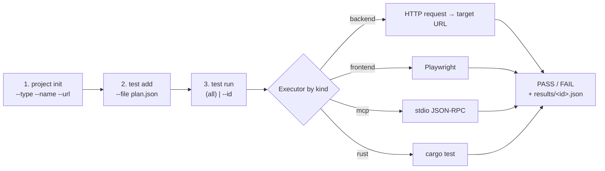
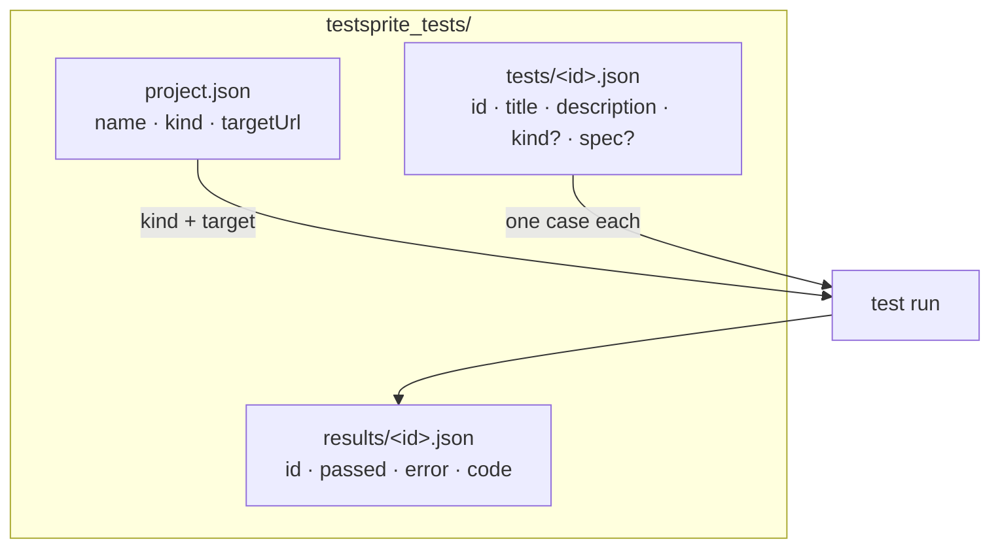
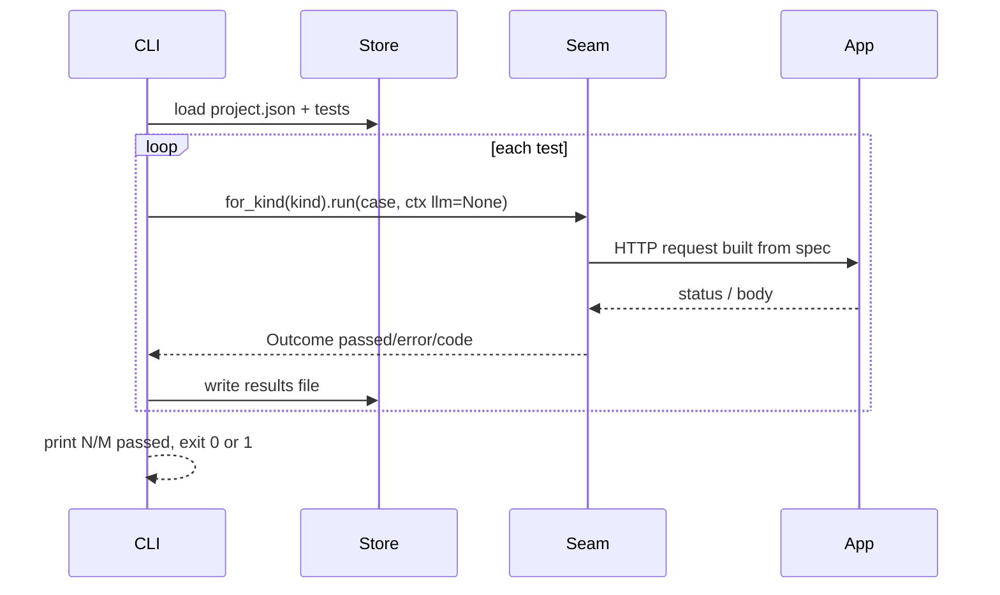

# testsprite-rs — the local test flow

The whole point: **test your stuff locally**, JSON-driven, with no TestSprite
account, no cloud, and no reverse tunnel. It reuses the same `Executor` seam the
cloud path uses — only the *driver* is a small local CLI over on-disk JSON.

Three commands, in order: **setup → add → run/validate**.



## The three steps

1. **setup** — `testsprite-rs project init --type backend --name myapp --url http://127.0.0.1:8080`
   writes `testsprite_tests/project.json`.
2. **add** — `testsprite-rs test add --file plan.json` validates the JSON and
   stores it at `testsprite_tests/tests/<id>.json` (an `id` is minted if absent).
   `testsprite-rs test list` shows what you have.
3. **run / validate** — `testsprite-rs test run` (all, or `--id <id>`) executes
   each stored test **locally** through the executor seam, prints one PASS/FAIL
   line per test, writes `testsprite_tests/results/<id>.json`, and exits `0` if
   every test passed else `1`.

## On-disk layout (all JSON, all local)



## What `test run` actually does (the seam, reused)

`test run` is a thin loop: it never branches on modality — `for_kind(kind)`
returns the right executor and the case is just JSON.



The key move: `ExecCtx.llm = None` selects **deterministic mode**. The backend
executor reads the case's embedded `spec` (`{method, path, body?, expect_status?}`)
and asserts the HTTP response directly — no LLM, no API key, no network beyond
the app under test. (Provide an OpenAI key later and the same seam upgrades to
LLM-generated tests without changing this flow.)

## A backend test case is just JSON

```json
{
  "title": "health endpoint returns 200",
  "description": "GET /health should return 200",
  "kind": "backend",
  "spec": { "method": "GET", "path": "/health", "expect_status": 200 }
}
```

`test add` mints an `id` when you omit one. That is the entire contract — a test
is JSON, so the planner/store/CLI never need modality-specific structs.

## How this maps to the cloud/CLI flow

Same shape as TestSprite's official `project → test → run`, but every step is a
local file and the runner is the in-process `Executor` seam instead of a cloud
sandbox reached through a reverse tunnel. Setup a project, add JSON tests, run
them, read pass/fail. Nothing else to configure.
