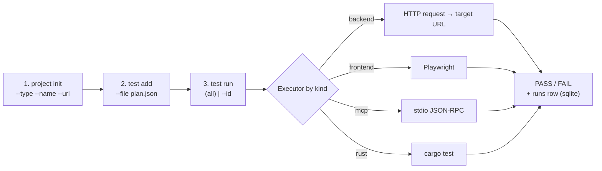
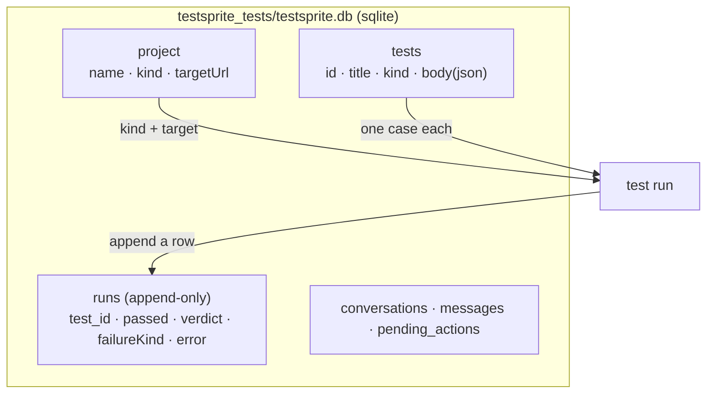
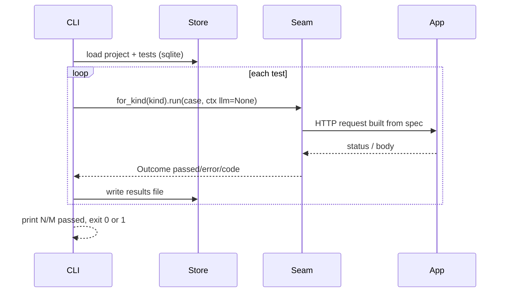

# testsprite-rs — the local test flow

The whole point: **test your stuff locally**, JSON-driven, with no TestSprite
account, no cloud, and no reverse tunnel. It reuses the same `Executor` seam the
cloud path uses — only the *driver* is a small local CLI over on-disk JSON.

Three commands, in order: **setup → summarize/generate → run/validate**.



## The three steps

1. **setup** — `testsprite-rs project init --type backend --name myapp --url http://127.0.0.1:8080`
   writes the project row into `testsprite_tests/testsprite.db`.
2. **summarize / generate / add** — `testsprite-rs project summarize` writes
   `testsprite_tests/tmp/code_summary.yaml` (tech stack, features/files,
   endpoints), mirroring the official MCP bootstrap step. Then use
   `testsprite-rs test generate --from testsprite_tests/tmp/code_summary.yaml`
   (LLM PRD/plan), `test generate --doc <openapi|postman|har>` (deterministic
   API import), `test audit --store` (LLM adversarial QA: assume the app is
   wrong and propose high-signal runnable tests), or `test add`/`test import`
   for tests you wrote yourself.
   Review generated requirements/plans with `testsprite-rs prd review --out
   prd-review.html`, then record the human checkpoint with `testsprite-rs prd
   approve`. Use `testsprite-rs test run --require-approved-prd` (or `loop --require-approved-prd`) when you want generated cases to be blocked until this review is recorded.
3. **run / validate** — `testsprite-rs test run` (all, or `--id <id>`) executes
   each stored test **locally** through the executor seam, prints one PASS/FAIL
   line per test, appends a row to the `runs` table (append-only history), exits `0` if
   every test passed else `1`.

## On-disk layout (one SQLite DB, all local)

Storage is a single SQLite database — `testsprite_tests/testsprite.db` (sqlx,
WAL) — not loose JSON files. Test JSON round-trips verbatim in `tests.body`.



## What `test run` actually does (the seam, reused)

`test run` is a thin loop: it never branches on modality — `for_kind(kind)`
returns the right executor and the case is just JSON.



The key move: `ExecCtx.llm = None` selects **deterministic mode**. The backend
executor reads the case's embedded `spec` or `steps` and asserts the HTTP
responses directly — no LLM, no API key, no network beyond the app under test.
(Provide an OpenAI key later and description-only cases can still upgrade to
LLM-generated code without changing this flow.)

## A backend test case is just JSON

```json
{
  "title": "health endpoint returns 200",
  "description": "GET /health should return 200",
  "kind": "backend",
  "spec": { "method": "GET", "path": "/health", "expect_status": 200 }
}
```

`test add` mints an `id` when you omit one. That is the entire contract — a test
is JSON, so the planner/store/CLI never need modality-specific structs.


## Real QA flows: session, auth, GraphQL, artifacts

A backend case can be a single `spec` or a multi-step `steps` flow. Steps share
a per-test session map, so one request can save values and later requests can
use `${var}` interpolation. Variables come from:

1. `.testsprite.env` (gitignored local secrets),
2. `testsprite_tests/variables.json` (`project set-var`),
3. process env (CI secrets).

```json
{
  "title": "login then query me",
  "kind": "backend",
  "steps": [
    {
      "id": "login",
      "method": "POST",
      "path": "/oauth/token",
      "form": {
        "client_id": "${TESTSPRITE_CLIENT_ID}",
        "username": "${TESTSPRITE_EMAIL}",
        "password": "${TESTSPRITE_PASSWORD}"
      },
      "expect_json": true,
      "save": { "accessToken": "$.access_token" }
    },
    {
      "id": "me",
      "auth": { "bearer": "${accessToken}" },
      "graphql": {
        "query": "{ me { id email } }",
        "expect_no_errors": true,
        "expect_data": { "me": {} }
      }
    }
  ]
}
```

Each run records a sanitized `testsprite-qa-artifact` in the run `code` field:
request method/URL/headers/body, response status/headers/body snippet, and the
keys saved by each step. Authorization, cookies, passwords, secrets, and token
fields are redacted. Export evidence with `testsprite-rs test artifact get <run_id>
--out bundle/` and reports with `testsprite-rs test report --out report.md` or
`--out report.pdf`, or a local dashboard with `testsprite-rs test dashboard --out dashboard.html`.


## Frontend QA steps (the visible TestSprite step list)

For browser/E2E cases, store `planSteps` instead of asking the LLM to invent a
new Playwright script on every run. The browser executor compiles common steps
into Playwright actions and captures screenshots:

```json
{
  "title": "member can sign in and see dashboard",
  "kind": "frontend",
  "planSteps": [
    "Input Email: ${TESTSPRITE_EMAIL}",
    "Input Password: ${TESTSPRITE_PASSWORD}",
    "Click Sign In",
    "Verify: Welcome Back"
  ]
}
```

To discover initial candidates from a live page, run:

```bash
testsprite-rs test explore --store                  # uses project targetUrl
testsprite-rs test explore --url http://localhost:5173 --depth 1 --limit 8 --out explore.json
testsprite-rs test explore --interactions --store  # opt-in: click controls and assert observed changes
```

It crawls same-origin links up to `--depth`, inventories visible headings, inputs, buttons, and links, then creates reviewable `planSteps` candidates (login form, page smoke, reachable actions) with stable selectors when available. `--interactions` is opt-in and clicks visible controls on a fresh page, then adds assertions for observed URL/heading changes. This is the bounded local version of TestSprite's autonomous exploratory QA.

Object form is supported when you know selectors. Add `selectors` for fallback
healing when the primary selector drifts:

```json
{ "action": "fill", "selector": "#email", "selectors": ["input[type=email]"], "value": "${TESTSPRITE_EMAIL}" }
{ "action": "click", "selector": "#sign-in", "selectors": ["text=Sign In"] }
{ "action": "assert_text", "text": "Dashboard" }
```

This matches the product architecture shown in TestSprite demos: generated or
authored test steps become executable browser actions; runs return pass/fail plus
visual evidence (screenshots plus `.webm` video recordings), without maintaining hand-written Playwright files for every
flow. Edit steps with `testsprite-rs test plan put <id> --file steps.json`, then
render the local replay with `testsprite-rs test replay <id> --out replay.html` (includes screenshots and video when present).

## How this maps to the cloud/CLI flow

Same shape as TestSprite's official `project → test → run`, but every step is a
local file and the runner is the in-process `Executor` seam instead of a cloud
sandbox reached through a reverse tunnel. Setup a project, add JSON tests, run
them, read pass/fail. Nothing else to configure.
